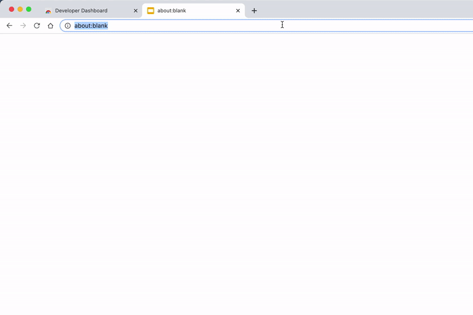

# Shoto

Notion search inside the URL bar.

## Demo

This extension using the same API and logic that you have in the workspace *Quick Find*

## Usage

 0. Install from store https://chrome.google.com/webstore/detail/shoto/lnnlchbbenkmimmhdfnljleabhajfebl
 1. Open to any notion page.
 2. Click the extension icon, it will save workspace id within that will it search.
 3. Now in browser URL bar just type `/` and press `space` or `tab` to start search.

### Multiple workspace

Right now it's only single workspace search.
